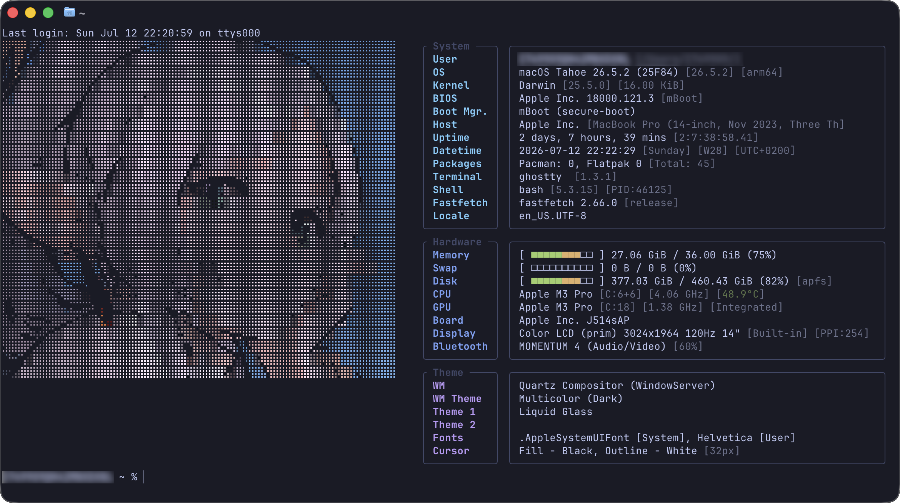
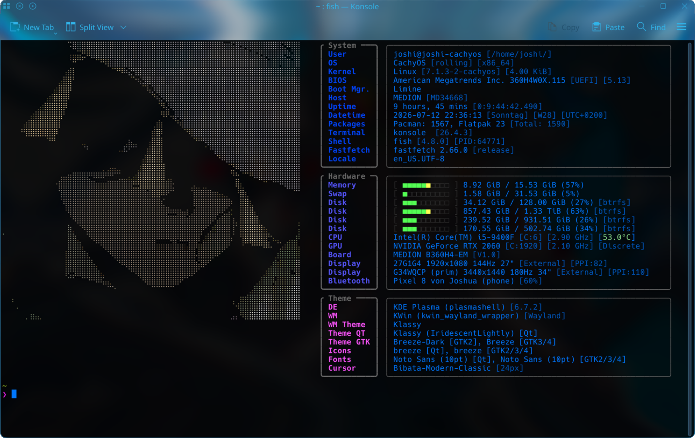

# Random ASCII Art in fastfetch

This repo contains my fastfetch as well as my shell config files.
On startup it selects a random ASCII art from `ascii-art/generated/` directory.

> [!warning] Do this or it will not work!
> You need to configure the `ascii-art/generated/` location in `run.sh`/`run.fish`/`config.fish`!

## Install

Place or link `config.jsonc` to `~/.config/fastfetch/`

> [!important]
> You will need to rename `config_macOS.jsonc` or `config_macOS.jsonc` to `config.jsonc` depending on your OS.

**Bash**: Append path of `run.sh`-file (e.g. `~/Code/terminal/run.sh`) to `~/.bashrc`
**Zsh**: Append path of `run.sh`-file (e.g. `~/Code/terminal/run.sh`) to `~/.zshrc`
**Fish**: Place or link `config.fish` to `~/.config/fish/` (or you can use `run.fish`)

_If you only want a greeting in certain terminals you can set it up like so: `[[ "$TERM_PROGRAM" == "ghostty" ]] && ~/Code/terminal/run.sh`. The greeting will only appear in Ghostty in this case._

> [!tip]
> The advantage of a link is that it automatically updates the config on `git pull`.

## Dependencies

- [fastfetch](https://github.com/fastfetch-cli/fastfetch)
- [ascii-image-converter](https://github.com/TheZoraiz/ascii-image-converter) (only if you plan on generating ASCII)

### Optional

Fish comes with useful features such as auto-suggestions, syntax highlighting and a substring-based search history. These also exist for Bash and Zsh with the following plugins.

**Zsh**:

- [zsh-autosuggestions](https://github.com/zsh-users/zsh-autosuggestions)
- [zsh-syntax-highlighting](https://github.com/zsh-users/zsh-syntax-highlighting)
- [zsh-history-substring-search](https://github.com/zsh-users/zsh-history-substring-search)

**Bash**: [ble.sh](https://github.com/akinomyoga/ble.sh).

## Screenshots

### MacOS

### CachyOS (KDE)

